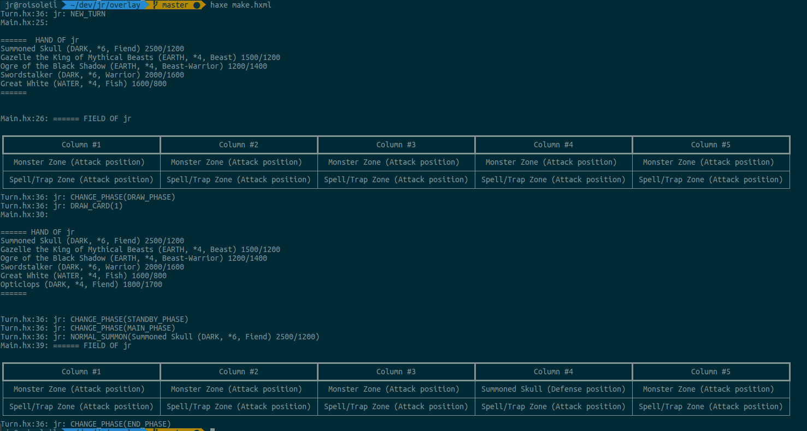

Overlay
=================

**Overlay** is a *Yu-Gi-Oh! Trading Card Game* engine made with **Haxe**

## Screenshots

This project is under development. Any screenshot displayed here has been taken during tests.



## Usage

### Build

#### Without Docker

```bash
yes | haxelib install all # first build
haxe make.hxml # build
neko bin/Overlay.n # run
```

#### With Docker

```bash
docker build . -t overlay # build
docker run overlay # run
```

## License

This project is distributed under the WTFPL v2.0
